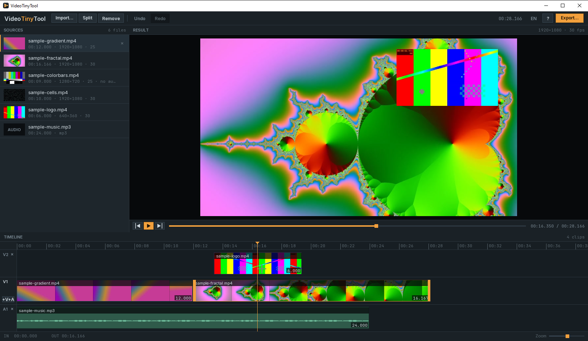
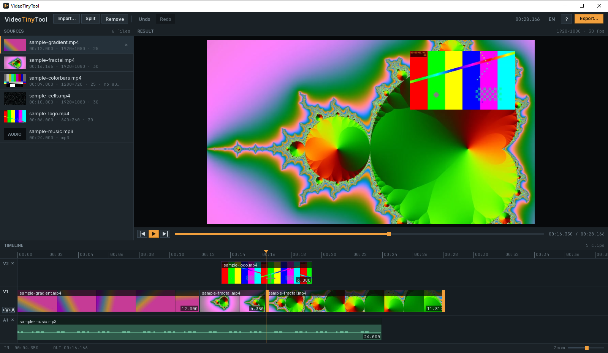
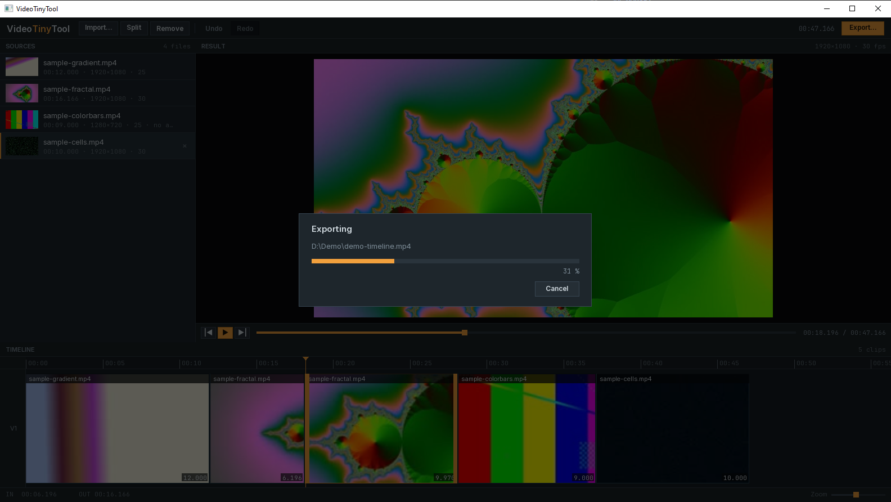
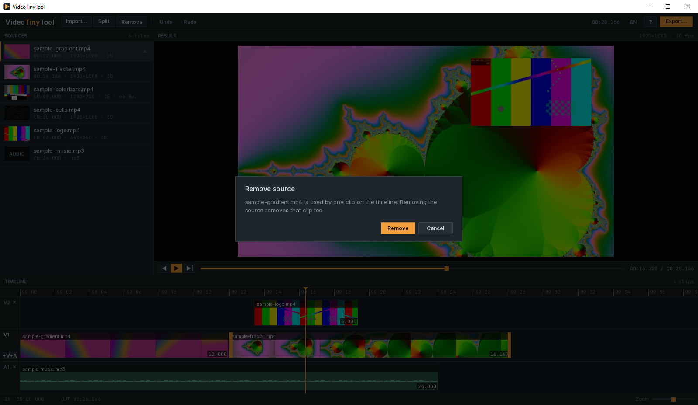

# VideoTinyTool

Портабельный настольный видеоредактор для Windows: загрузить файлы, выложить из них последовательность на таймлайне, подрезать, разрезать и переставить клипы, посмотреть склейку в превью со звуком и выгрузить одним файлом.

Приложение целиком помещается в одну папку. Удалили папку — на компьютере не осталось ни одного следа: ни в `%APPDATA%`, ни в `%TEMP%`, ни в реестре.



*На скриншотах — синтетические тестовые ролики, сгенерированные ffmpeg.*

## Возможности

- **Импорт** через системный диалог, метаданные читаются `ffprobe`: длительность, разрешение, fps, кодеки, наличие звука.
- **Таймлайн** с одной видеодорожкой: клипы встык, плёнка из миниатюр внутри клипа, линейка со временем, playhead, масштабирование.
- **Редактирование**: подрезка краёв перетаскиванием, разрез по playhead, перестановка клипов, удаление, удаление источника вместе со всеми его клипами.
- **Undo/Redo** на 100 шагов — каждое действие является командой с полным откатом.
- **Превью склейки** целиком, со звуком, без предварительной сборки файла: плеер декодирует прямо из источников и переключается на границах клипов.
- **Скраббинг** перетаскиванием playhead, шаттл `J`/`K`/`L`, покадровый шаг.
- **Экспорт** в один файл с перекодированием, прогрессом и отменой. Профиль выбирается перед стартом в модальном окне, у каждой настройки есть подсказка при наведении.

### Таймлайн и разрез

Клип разрезается по позиции playhead, обе половины остаются на дорожке, откат — одним `Ctrl + Z`.



### Экспорт

Кнопка «Экспорт…» сначала открывает окно настроек: контейнер, видеокодек, CRF, пресет, разрешение, частота кадров, аудиокодек и битрейт звука. Значения перебираются стрелками `<` и `>`, при наведении на строку всплывает подсказка о том, на что настройка влияет. Начальные значения берутся из `settings.json`, выбранные живут до закрытия приложения.

Дальше идёт системный диалог сохранения. Все клипы приводятся к выбранному профилю и склеиваются фильтром `concat`. Прогресс читается из лога ffmpeg, `Cancel` мягко останавливает процесс и удаляет недописанный файл.



### Удаление источника

Если источник уже использован на таймлайне, приложение сначала спрашивает подтверждение и называет число клипов, которые уйдут вместе с ним. Возвращает всё на место один `Undo`.



## Горячие клавиши

| Клавиши | Действие |
|---|---|
| `Space` | воспроизведение / пауза |
| `J` / `K` / `L` | ускоренная перемотка назад / стоп / вперёд (1×, 2×, 4×) |
| `←` / `→` | шаг на кадр |
| `Shift + ←` / `→` | шаг на секунду |
| `Home` / `End` | в начало / конец таймлайна |
| `I` / `O` | подрезать выделенный клип по playhead слева / справа |
| `S` или `Ctrl + K` | разрезать клип под playhead |
| `Delete` | удалить выделенный клип, оставив на его месте пустоту |
| `Shift + Delete` | удалить выделенный клип и сдвинуть остальные влево |
| `Ctrl + Z` | отменить |
| `Ctrl + Shift + Z`, `Ctrl + Y` | повторить |
| `Ctrl + O` | импорт |
| `Ctrl + M` | экспорт |
| `+` / `-` | масштаб таймлайна |

Обычное удаление не двигает соседние клипы: на месте удалённого остаётся пустота, и всё, что стояло правее, сохраняет своё время. В превью и в экспорте пустота — это чёрный кадр с тишиной. Клипы смещаются только когда их двигают вручную или удаляют через `Shift + Delete`.

Мышь: колесо — прокрутка таймлайна, `Ctrl` + колесо — масштаб, двойной клик по источнику — добавить его целиком в конец таймлайна.

## Стек

| | |
|---|---|
| Runtime | .NET 9, Windows x64 |
| Графика и ввод | SFML.Net 3.0.0 |
| Звук | SFML.Audio, PCM-поток из ffmpeg |
| Видео | NReco.VideoConverter 1.2.1 + `ffmpeg.exe` и `ffprobe.exe` рядом с exe |
| Тесты | xUnit |

## Сборка и запуск

Нужен .NET 9 SDK и Windows x64.

```
dotnet build   VideoTinyTool.sln
dotnet test    tests/VideoTinyTool.Tests/VideoTinyTool.Tests.csproj
dotnet publish src/VideoTinyTool.App/VideoTinyTool.App.csproj -c Release -o publish
```

`ffmpeg.exe` приходит из пакета `NReco.VideoConverter` и копируется в выходную папку автоматически. `ffprobe.exe` в пакет не входит: цель `StageFFprobe` берёт его из папки `tools/`, а если её нет — из `PATH`. Подойдёт любая сборка ffmpeg 6 или новее.

Результат публикации — папка поставки: `VideoTinyTool.exe`, рядом `ffmpeg.exe`, `ffprobe.exe` и `assets/` со шрифтами и файлами локализации. Все DLL, включая нативные CSFML, лежат внутри exe и выкладываются в `runtime/` рядом с ним при первом запуске. `settings.json` создаётся там же.

## Портабельность

- `FFMpegConverter.FFMpegToolPath` жёстко указывает на папку приложения — иначе NReco распаковал бы вшитый ffmpeg во временную папку.
- `IncludeNativeLibrariesForSelfExtract` выключен, нативные библиотеки не попадают в `%TEMP%\.net`: они embedded-ресурсы и разворачиваются в `runtime/` рядом с exe.
- Кэш миниатюр живёт только в памяти, на диск ничего не пишется.

## settings.json

Создаётся при первом запуске рядом с exe, читается один раз при старте, приложением никогда не перезаписывается. Секция `export` задаёт значения, с которыми открывается окно настроек экспорта. Битый файл не роняет приложение — недостающие поля берутся из значений по умолчанию.

```json
{
  "export": {
    "container": "mp4",
    "videoCodec": "libx264",
    "crf": 20,
    "preset": "medium",
    "width": 1920,
    "height": 1080,
    "frameRate": 30,
    "speed": 1,
    "audioCodec": "aac",
    "audioBitrateKbps": 192
  },
  "preview": { "width": 960, "height": 540 },
  "window": { "width": 1600, "height": 900 },
  "ui": { "language": "en" }
}
```

## Локализация

Весь текст интерфейса лежит в `assets/localization/<язык>.json`, в коде строк нет. В поставке два файла: `en.json` и `ru.json`. Язык выбирается полем `ui.language` в `settings.json`.

```json
{
  "toolbar": { "import": "Импорт…", "split": "Разрезать" },
  "sources": { "fileCount": { "one": "{0} файл", "few": "{0} файла", "many": "{0} файлов" } }
}
```

Ключи вложенные, значения — шаблоны `string.Format` с позиционными `{0}`, `{1}`. Формы множественного числа выбираются по правилам языка: `one`/`other` для английского, `one`/`few`/`many` для русского.

Свой язык — это новый файл рядом с готовыми: скопировать `en.json`, перевести значения, положить как `assets/localization/de.json` и указать `"language": "de"`. Недостающие ключи и битый файл не роняют приложение: английский текст вшит в exe и подставляется на месте каждого пропущенного ключа, а о проблеме приложение сообщает окном при старте.

## Структура

```
VideoTinyTool.sln
build/stage-ffprobe.ps1        копирование ffprobe в выходную папку
tools/                         сюда можно положить ffprobe.exe
src/VideoTinyTool.App/
  Application/                 главный цикл, настройки, пути
  Domain/                      источники, клипы, таймлайн
  Commands/                    команды редактирования и история
  Media/                       ffmpeg-конвейеры, превью, миниатюры, экспорт
  Localization/                каталог строк, правила множественного числа
  Ui/                          раскладка, панели, виджеты, тема
  Platform/                    системные диалоги, консольное окно, нативные библиотеки
  Assets/fonts/                Inter, JetBrains Mono
  Assets/localization/         en.json, ru.json
tests/VideoTinyTool.Tests/     доменная модель, команды, разбор вывода ffmpeg/ffprobe
```

## Тесты

Юнит-тесты покрывают доменную модель, команды с откатом, разбор JSON `ffprobe`, разбор строк лога ffmpeg, сборку строки аргументов экспорта, каталог локализации и правила множественного числа. ffmpeg при этом не запускается, тестов интерфейса нет.

## Вне объёма этой версии

Переходы между клипами, несколько дорожек, отдельная работа со звуком, drag & drop файлов в окно, сохранение проекта, экспорт без перекодирования, экран общих настроек, смена языка без перезапуска, другие ОС.
